# 🎉 Flujo de Success Page - Ecommerce Externo

## 🔄 **Flujo Completo en Success Page**

```mermaid
sequenceDiagram
    participant E as Ecommerce
    participant API as API
    participant FB as Firestore
    
    Note over E: Usuario llega a Success Page ✅
    
    E->>API: 1. GET /api/orders/{id}
    API->>FB: Buscar orden en colección "orders"
    FB-->>API: Datos de la orden
    API-->>E: Orden encontrada
    
    E->>API: 2. POST /api/orders/{id}/mark-success
    API->>FB: Actualizar status = "success"
    FB-->>API: Orden actualizada
    API-->>E: Orden marcada como exitosa
    
    E->>API: 3. POST /api/ventas
    API->>FB: Crear venta en colección "ventas"
    FB-->>API: Venta creada
    API-->>E: Venta guardada
    
    Note over E: 4. Limpiar carrito y mostrar éxito
```



---

## 📋 **Paso a Paso Detallado**

### **Paso 1: Obtener Orden** 📖
```
GET /api/orders/{id}
```

**Propósito:** Obtener los datos completos de la orden para procesarla.

**Request:**
```javascript
const response = await fetch(`/api/orders/${orderId}`);
const orderData = await response.json();
```

**Response exitosa (200):**
```json
{
  "success": true,
  "data": {
    "id": "firestore-doc-id",
    "orderId": "uuid-generado",
    "userId": "email@usuario.com",
    "status": "pending",
    "total": 200,
    "createdAt": "2025-01-17T10:30:00.000Z",
    "updatedAt": "2025-01-17T10:30:00.000Z",
    "customerInfo": {
      "nombre": "Juan Pérez",
      "email": "email@usuario.com",
      "telefono": "123456789",
      "dni": "12345678"
    },
    "deliveryInfo": {
      "direccion": "Calle Falsa 123",
      "ciudad": "Buenos Aires",
      "codigoPostal": "1234",
      "metodoEntrega": "Delivery"
    },
    "items": [
      {
        "id": "product-id",
        "name": "Nombre del producto",
        "price": 100,
        "quantity": 2,
        "category": "Categoría",
        "subcategory": "Subcategoría"
      }
    ]
  },
  "message": "Orden encontrada exitosamente"
}
```

**Response error (404):**
```json
{
  "success": false,
  "error": "Orden no encontrada",
  "code": "ORDER_NOT_FOUND",
  "orderId": "uuid-generado"
}
```

---

### **Paso 2: Marcar como Exitosa** ✅
```
POST /api/orders/{id}/mark-success
```

**Propósito:** Cambiar el estado de la orden de "pending" a "success".

**Request:**
```javascript
const response = await fetch(`/api/orders/${orderId}/mark-success`, {
  method: 'POST',
  headers: {
    'Content-Type': 'application/json' // Opcional
  },
  body: JSON.stringify({
    // Datos adicionales opcionales
    paymentMethod: "mercadopago",
    transactionId: "mp-123456",
    completedAt: new Date().toISOString()
  })
});
```

**Response exitosa (200):**
```json
{
  "success": true,
  "message": "Orden marcada como exitosa correctamente",
  "orderId": "uuid-generado",
  "status": "success",
  "previousStatus": "pending",
  "updatedAt": "2025-01-17T11:00:00.000Z",
  "markedSuccessAt": "2025-01-17T11:00:00.000Z",
  "data": {
    "orderId": "uuid-generado",
    "userId": "email@usuario.com",
    "status": "success",
    "total": 200,
    "customerInfo": { /* ... */ },
    "deliveryInfo": { /* ... */ },
    "items": [ /* ... */ ],
    "itemsCount": 1
  }
}
```

**Response si ya está marcada (200):**
```json
{
  "success": true,
  "message": "La orden ya estaba marcada como exitosa",
  "orderId": "uuid-generado",
  "status": "success",
  "previousStatus": "success",
  "updatedAt": "2025-01-17T10:45:00.000Z"
}
```

---

### **Paso 3: Crear Venta Final** 💰
```
POST /api/ventas
```

**Propósito:** Registrar la venta en el sistema para reportes y seguimiento.

**Request:** (Transformar datos de la orden al formato de venta)
```javascript
const ventaData = {
  success: true,
  data: [
    {
      numeroPedido: `VENTA-${Date.now()}`, // Generar número único
      estado: "confirmado",
      total: orderData.total,
      fecha: new Date().toISOString().split('T')[0],
      fechaEntrega: null, // Se asignará después
      medioPago: "mercadopago",
      productos: orderData.items.map(item => ({
        id: item.id,
        nombre: item.name,
        cantidad: item.quantity,
        precio: item.price,
        unidad: "Unidad",
        categoria: item.category,
        imagen: "",
        alto: 0,
        ancho: 0,
        largo: 0,
        cepilladoAplicado: false
      })),
      envio: {
        estado: "pendiente",
        direccion: orderData.deliveryInfo.direccion,
        transportista: orderData.deliveryInfo.metodoEntrega,
        fechaEntrega: null
      },
      cliente: {
        nombre: orderData.customerInfo.nombre,
        telefono: orderData.customerInfo.telefono
      }
    }
  ],
  total: 1,
  usuario: {
    email: orderData.userId
  }
};

const response = await fetch('/api/ventas', {
  method: 'POST',
  headers: {
    'Content-Type': 'application/json'
  },
  body: JSON.stringify(ventaData)
});
```

---

### **Paso 4: Limpiar y Mostrar Éxito** 🎊
```javascript
// Limpiar carrito local
localStorage.removeItem('cart');
sessionStorage.removeItem('tempOrder');

// Mostrar mensaje de éxito
showSuccessMessage({
  orderNumber: orderData.numeroPedido,
  total: orderData.total,
  email: orderData.customerInfo.email
});

// Redirigir después de unos segundos (opcional)
setTimeout(() => {
  window.location.href = '/account/orders';
}, 5000);
```

---

## 🔧 **Implementación Completa en JavaScript**

```javascript
class SuccessPageHandler {
  constructor(orderId) {
    this.orderId = orderId;
    this.baseURL = 'https://maderascaballero.vercel.app';
  }

  async processSuccessFlow() {
    try {
      console.log('🚀 Iniciando flujo de success page...');

      // Paso 1: Obtener orden
      const orderData = await this.getOrder();
      console.log('✅ Paso 1: Orden obtenida', orderData);

      // Paso 2: Marcar como exitosa
      const successResult = await this.markOrderAsSuccess();
      console.log('✅ Paso 2: Orden marcada como exitosa', successResult);

      // Paso 3: Crear venta final
      const ventaResult = await this.createFinalSale(orderData);
      console.log('✅ Paso 3: Venta creada', ventaResult);

      // Paso 4: Limpiar y mostrar éxito
      this.cleanupAndShowSuccess(orderData);
      console.log('✅ Paso 4: Proceso completado');

      return {
        success: true,
        order: orderData,
        venta: ventaResult
      };

    } catch (error) {
      console.error('❌ Error en flujo de success:', error);
      this.handleError(error);
      throw error;
    }
  }

  async getOrder() {
    const response = await fetch(`${this.baseURL}/api/orders/${this.orderId}`);
    
    if (!response.ok) {
      throw new Error(`Error obteniendo orden: ${response.status}`);
    }
    
    const result = await response.json();
    
    if (!result.success) {
      throw new Error(result.error || 'Error desconocido');
    }
    
    return result.data;
  }

  async markOrderAsSuccess(additionalData = {}) {
    const response = await fetch(`${this.baseURL}/api/orders/${this.orderId}/mark-success`, {
      method: 'POST',
      headers: {
        'Content-Type': 'application/json'
      },
      body: JSON.stringify({
        completedAt: new Date().toISOString(),
        source: 'success_page',
        ...additionalData
      })
    });
    
    if (!response.ok) {
      throw new Error(`Error marcando orden como exitosa: ${response.status}`);
    }
    
    const result = await response.json();
    
    if (!result.success) {
      throw new Error(result.error || 'Error desconocido');
    }
    
    return result;
  }

  async createFinalSale(orderData) {
    const ventaData = {
      success: true,
      data: [
        {
          numeroPedido: `VENTA-${Date.now()}`,
          estado: "confirmado",
          total: orderData.total,
          fecha: new Date().toISOString().split('T')[0],
          fechaEntrega: null,
          medioPago: "mercadopago",
          productos: orderData.items.map(item => ({
            id: item.id,
            nombre: item.name,
            cantidad: item.quantity,
            precio: item.price,
            unidad: "Unidad",
            categoria: item.category,
            imagen: "",
            alto: 0,
            ancho: 0,
            largo: 0,
            cepilladoAplicado: false
          })),
          envio: {
            estado: "pendiente",
            direccion: orderData.deliveryInfo.direccion,
            transportista: orderData.deliveryInfo.metodoEntrega,
            fechaEntrega: null
          },
          cliente: {
            nombre: orderData.customerInfo.nombre,
            telefono: orderData.customerInfo.telefono
          }
        }
      ],
      total: 1,
      usuario: {
        email: orderData.userId
      }
    };

    const response = await fetch(`${this.baseURL}/api/ventas`, {
      method: 'POST',
      headers: {
        'Content-Type': 'application/json'
      },
      body: JSON.stringify(ventaData)
    });
    
    if (!response.ok) {
      throw new Error(`Error creando venta: ${response.status}`);
    }
    
    const result = await response.json();
    
    if (!result.success) {
      throw new Error(result.error || 'Error desconocido');
    }
    
    return result;
  }

  cleanupAndShowSuccess(orderData) {
    // Limpiar almacenamiento local
    localStorage.removeItem('cart');
    localStorage.removeItem('checkout_data');
    sessionStorage.removeItem('temp_order');
    
    // Mostrar mensaje de éxito
    this.showSuccessMessage(orderData);
    
    // Opcional: redirigir después de unos segundos
    setTimeout(() => {
      window.location.href = '/account/orders';
    }, 10000);
  }

  showSuccessMessage(orderData) {
    const message = `
      ✅ ¡Compra exitosa!
      
      Orden: ${orderData.orderId}
      Total: $${orderData.total.toLocaleString()}
      Email: ${orderData.customerInfo.email}
      
      Te enviaremos un email con los detalles.
    `;
    
    // Mostrar en tu UI
    document.getElementById('success-message').innerHTML = message;
  }

  handleError(error) {
    console.error('Error en success page:', error);
    
    // Mostrar error al usuario
    document.getElementById('error-message').innerHTML = `
      ❌ Error procesando la compra: ${error.message}
      
      Por favor contacta con soporte.
    `;
  }
}

// Uso en la página de éxito
document.addEventListener('DOMContentLoaded', async () => {
  const urlParams = new URLSearchParams(window.location.search);
  const orderId = urlParams.get('orderId');
  
  if (!orderId) {
    console.error('No se encontró orderId en la URL');
    return;
  }
  
  const handler = new SuccessPageHandler(orderId);
  
  try {
    await handler.processSuccessFlow();
  } catch (error) {
    console.error('Error en flujo de success:', error);
  }
});
```

---

## 📊 **Estados de Orden**

| Estado | Descripción | Cuándo se usa |
|--------|-------------|---------------|
| `pending` | Orden creada, pago pendiente | Al crear la orden inicial |
| `success` | Pago confirmado, orden exitosa | Después del pago exitoso |
| `failed` | Pago fallido | Si el pago falla |
| `cancelled` | Orden cancelada | Si se cancela la orden |
| `processing` | En procesamiento | Opcional: estado intermedio |

---

## 🚨 **Manejo de Errores**

### **Errores Comunes:**
1. **Orden no encontrada** (404) - Verificar que el ID sea correcto
2. **Orden ya procesada** (200) - Manejar como éxito
3. **Error de red** (503) - Reintentar después de unos segundos
4. **Error de permisos** (403) - Verificar configuración de Firestore

### **Estrategias de Retry:**
```javascript
async function retryOperation(operation, maxRetries = 3) {
  for (let i = 0; i < maxRetries; i++) {
    try {
      return await operation();
    } catch (error) {
      if (i === maxRetries - 1) throw error;
      await new Promise(resolve => setTimeout(resolve, 1000 * (i + 1)));
    }
  }
}
```

---

**¡Tu flujo de success page está completo y listo para usar!** 🎉
